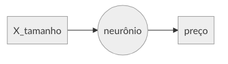
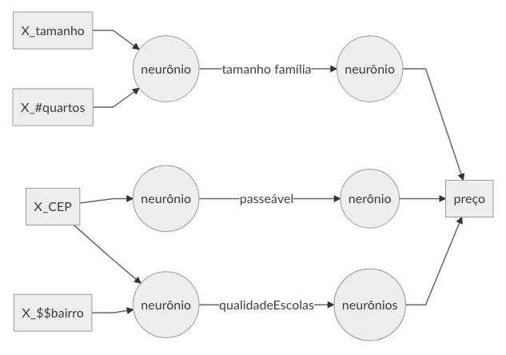

# Anotações - DeepLearning.ai Coursera

## Módudo 1 - Neural Networks and Deep Learning

### Introdução

**O que é uma Rede Neural?**
 
 Uma rede neural simples pode ser comparada a uma função de regressão linear. Como exemplo, se quisermos predizer o valor de uma casa baseado no tamanho da mesma, pode-se construir uma rede neural simples com apenas um neurônio, que recebe o tamanho como entrada, computa através deu uma função linear e retorna como output o preço:

> \*Rede de um único neurônio é chamada de Perceptron

Uma rede mais complexa seria como o exemplo abaixo adicionando mais valores de entrada e neurônios na camada intermediária (chamada de hidden Layer  ou camada oculta):

Na prática precisamos apenas definir as variáveis de entrada (X) e dizer qual a saída, no caso o preço, para cada exemplo. Todos os neurônios de entrada são ligados aos neurônios da camada oculta. A relação entre as variáveis é o que a rede vai aprender.

>\*Definição alternativa: As Redes Neurais Artificiais são baseadas na biologia, tendo como unidade principal o neurônio artificial, que simula o comportamento do neurônio biológico. No modelo computacional de um neurônio, os sinais interagem entre os neurônios, de acordo com o peso dado à relação entre eles (ou seja, cada aresta ligando um neurônio ao outro possui um peso w). A ideia é que os pesos sejam aprendidos e controlem a força de influência de um neurônio em outro. Essa interação é modelada por uma função, que geralmente assume a forma de uma soma ponderada.

 **Aprendizado Supervisionado: exemplos de aplicações**

- Mercado imobiliário: detecção de preços de imóveis. Utilizando Neural Networks simples
- Propaganda: predição de clicks. Utilizando Neural Networks simples
- Reconhecimento de objetos. Utilizando Deep Learning, como CNN's (Convolutional Neural Networks).
- Speech recognition. Utilizando Deep Learning, como RNN's (Recurrent Neural Networks).
- Tradução automática. Utilizando Deep Learning, como RNN's.
- Carros autônomos. (Misto de vários algoritmos)

Neural Networks, mais especificamente Deep Learning, tem grande aplicações em datas não-estruturados, como: Imagens, Aúdios e Textos.

**Por que o crescimento de Deep Learning?**

Algoritmos tradicionais tendem a estabilizar a performance apartir de uma certa quantidade de dados, enquanto redes neurais tendem a ficar cada vez melhores quanto mais dados são utilizados para o aprendizado.

Portanto, o principal motivo que faz com que as NN cresçam nos últimos anos é o grande aumento na quantidade de **dados** disponíveis.  Além disso, o poder **computacional** também é muito maior nos dias atuais, principalmente com a utilização de GPU's. O que também permitiu o desenvolvimento de **algoritmos** mais complexos e potentes.

### Regressão Logística como NN

**Notação Geral**:
X: variáveis de entrada X $\epsilon$  $\R^{n_x}$, onde n é o número de variáveis x.
Y: variável de saída. Y $\epsilon$  {0,1}
M: número de exemplos

**Regressão Logística**
- Notação: 
   Queremos obter $\hat{y} = P(y=1|x)$, ou seja, a probabilidade de $y$ ser igual a 1 dado $x$.
   Parâmetros: $w$ $\epsilon$  $\R^{n_x}$ e $b$ $\epsilon$  $\R$
   Saída: $\hat{y} = w^Tx + b$ 

Por se tratar de uma probabilidade, $\hat{y}$ precisa estar dentro do intervalo [0,1]. Para isso usaremos a função sigmoid
 $\sigma(z) = \frac{1}{1+e^{-z}}$, onde  $z = w^Tx + b$.

Para aprender os parâmetros $w$ e $b$ é preciso uma **função de custo**. Primeiro, vamos definir uma função de perda ou $Loss Function$ para uma instância:

$L(\hat{y},y)=-(y\log{\hat{y}} + (1-y)\log{(1-\hat{y})})$

Se uma instância tem label 1, então $(1-y)$ é $0$, deixando apenas o lado esquerdo da equação. Pra que ele seja o menor possível, $\hat{y}$ precisa ser o maior possível, no caso o mais próximo de 1. O oposto também se aplica para quando o label é 0.

Com isso, temos a funcão de custo:

$J(w,b)=\frac{1}{m}\sum_{i=1}^{m}L(\hat{y}^i,y^i)$

Dado nosso custo, queremos encontrar $w$ e $b$ que minimize esse custo. Para isso utilizamos o **Gradiente Descendente**. A função de custo é uma funcão convexa, como uma bacia, então o que o gradiente faz é ir descendo o mais rápido possível até chegar no fundo da bacia, no menor ponto, independente do ponto inicial.

Para fazer essa "decida", utilizaremos a derivada do custo e uma taxa de aprendizado ou *learning rate*, da seguinte forma:

A cada iteração do algoritmo temos $w = w - \alpha \frac{\mathrm{d}J}{\mathrm{d}w}$, sendo $\alpha$ o learning rate.

De modo geral, atualizamos w e b a cada iteração, sendo a velocidade controlada pelo learning rate, até chegarmos no ponto mínimo de custo.

> \*Há alguns outros poréns, como o mínimo local, que serão discutidos posteriormentes.

... continua ...
